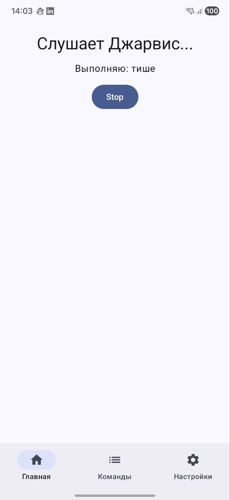
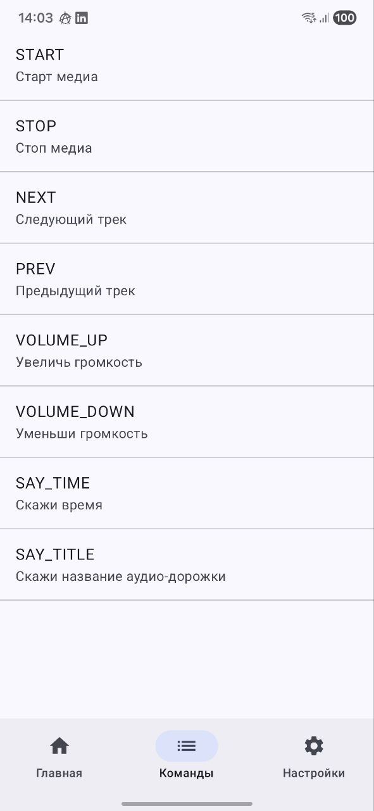
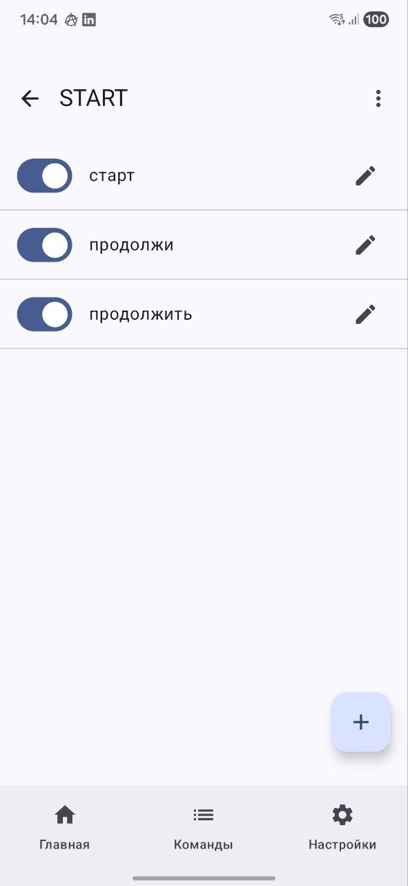
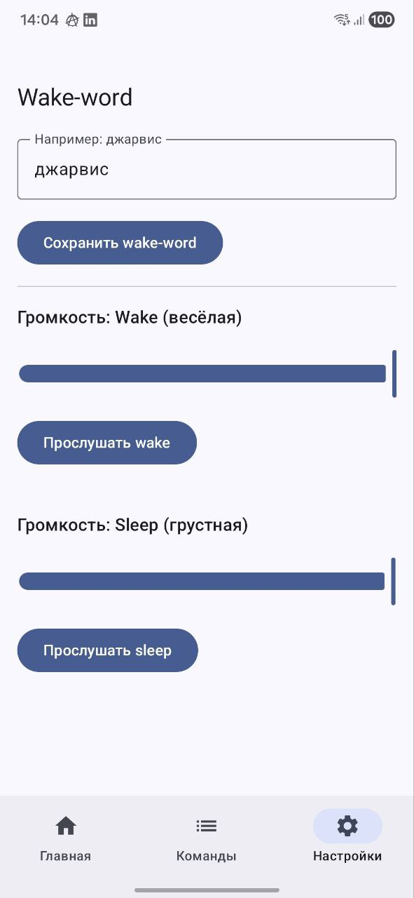
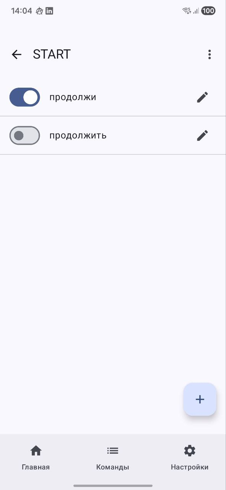
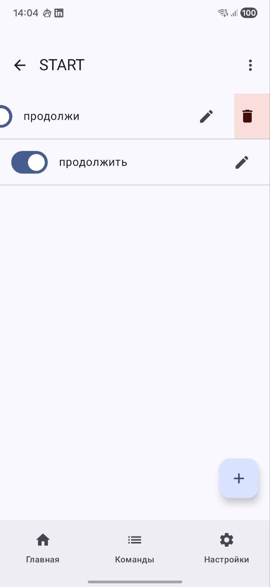
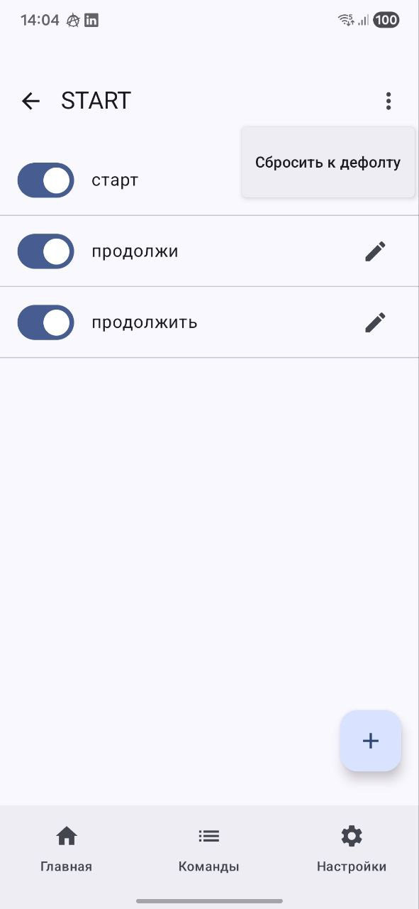

## О проекте

VoiceMediaController — мобильный голосовой помощник для управления воспроизведением медиа (старт/стоп, следующий/предыдущий трек, громкость) и простыми голосовыми ответами (время/название текущей аудио-дорожки).

Ключевая особенность — оффлайн-распознавание: команды распознаются локально на устройстве (без отправки аудио в сеть). Фразы команд можно редактировать в приложении: добавлять, удалять, включать/выключать и сбрасывать к дефолту.

Wake-word по умолчанию: **«джарвис»**.

Для команд «Скажи время» и «Скажи название аудио-дорожки» используется TTS (Text-to-Speech) — приложение проговаривает результат голосом.

## Дефолтные команды

| Действие                     | Фразы по умолчанию                      |
| ---------------------------- | --------------------------------------- |
| Старт медиа                  | `старт`, `продолжи`, `продолжить`       |
| Стоп медиа                   | `стоп`                                  |
| Следующий трек               | `следующий трек`, `следующий`, `некст`  |
| Предыдущий трек              | `предыдущий трек`, `предыдущий`, `прев` |
| Увеличь громкость            | `громче`, `увеличь`                     |
| Уменьши громкость            | `тише`, `уменьши`                       |
| Скажи время                  | `время`                                 |
| Скажи название аудио-дорожки | `название`                              |

## Скриншоты

### Главный экран

### Команды и редактирование

  
  
  

### Управление фразами (disable / delete / defaults)

  
  
  

